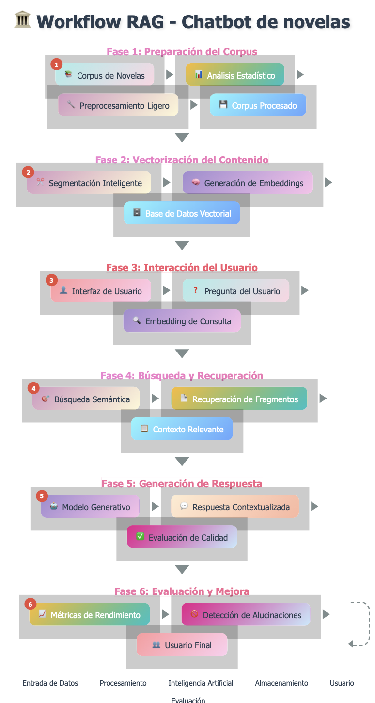
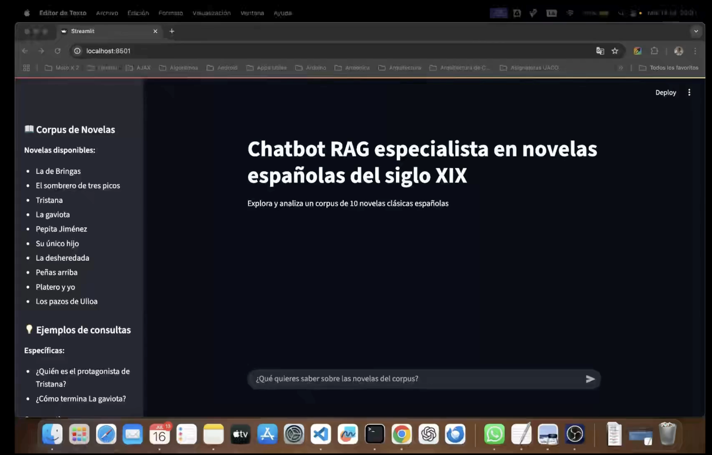

# Chatbot de Novelas Españolas

Sistema de chatbot con tecnología RAG (Retrieval-Augmented Generation) para consultas sobre un corpus de 10 novelas españolas clásicas.

## Descripción del Proyecto

Este proyecto implementa un chatbot inteligente que puede responder preguntas sobre literatura española clásica utilizando un corpus de 10 novelas. El sistema combina análisis de texto, embeddings semánticos y modelos de lenguaje para proporcionar respuestas contextualmente relevantes.

## Arquitectura del Sistema

El sistema RAG para novelas españolas sigue un flujo de trabajo estructurado en múltiples etapas:

### Flujo de Procesamiento

1. **Descarga del Corpus**: Descarga automática del dataset de novelas desde Google Drive
2. **Preprocesamiento**: Las 10 novelas se procesan individualmente, aplicando limpieza ligera que preserva la estructura semántica.
3. **Chunking**: Cada novela se divide en fragmentos de texto manejables usando RecursiveCharacterTextSplitter.
4. **Embeddings**: Se generan embeddings semánticos para cada fragmento usando el modelo `jinaai/jina-embeddings-v2-small-en`.
5. **Almacenamiento**: Los embeddings se almacenan en ChromaDB como base de datos vectorial persistente.
6. **Consulta**: El sistema procesa preguntas del usuario, genera embeddings y busca fragmentos relevantes.
7. **Generación**: Un modelo LLM (Groq) genera respuestas contextualizadas basadas en los fragmentos recuperados.

### Workflow Técnico Actualizado

```
[Descarga del Corpus] → [Corpus de Novelas] → [Análisis Estadístico] → [Preprocesamiento Ligero] → [Corpus Procesado]
                                    ↓
[Segmentación Inteligente] → [Generación de Embeddings] → [Base de Datos Vectorial]
                                    ↓
[Interfaz de Usuario] ← [Pregunta del Usuario] → [Embedding de Consulta]
                                    ↓
[Búsqueda Semántica] → [Recuperación de Fragmentos] → [Contexto Relevante]
                                    ↓
[Modelo Generativo] → [Respuesta Contextualizada] → [Evaluación de Calidad]
                                    ↓
[Métricas de Rendimiento] → [Detección de Alucinaciones] → [Usuario Final]
```



## Corpus de Novelas

El proyecto incluye las siguientes novelas españolas:

- **El sombrero de tres picos** - Pedro Antonio de Alarcón
- **La de Bringas** - Benito Pérez Galdós
- **La desheredada** - Benito Pérez Galdós
- **La gaviota** - Fernán Caballero
- **Los pazos de Ulloa** - Emilia Pardo Bazán
- **Pepita Jiménez** - Juan Valera
- **Peñas arriba** - José María de Pereda
- **Platero y yo** - Juan Ramón Jiménez
- **Su único hijo** - Leopoldo Alas "Clarín"
- **Tristana** - Benito Pérez Galdós

## Estructura del Proyecto

```
chatbot_novelas/
│
├── 0_descargar_corpus.ipynb                # Notebook para descargar el corpus de novelas
├── 1_analisis_preprocesamiento.ipynb       # Notebook de análisis y preprocesamiento
├── 2_generar_embeddings_chroma.ipynb       # Notebook para generar embeddings y base de datos vectorial
├── 3_aplicacion_novelas.py                 # Aplicación Streamlit del chatbot
├── 4_evaluacion_hallucination.py           # Script de evaluación de alucinaciones
├── requirements.txt                        # Dependencias del proyecto
│
├── novelas_txt/                            # Corpus original de novelas (se descarga)
│   ├── El_sombrero_de_tres_picos_pg29506.txt
│   ├── La_de_Bringas_314648.txt
│   ├── La_desheredada_pg25956.txt
│   ├── La_gaviota_pg23600.txt
│   ├── Los_pazos_de_Ulloa_18005-8_UTF8.txt
│   ├── Pepita_Jimenez_pg17223.txt
│   ├── Peñas_arriba_pg24127.txt
│   ├── Platero_y_yo_pg9980.txt
│   ├── Su_unico_hijo_pg17341.txt
│   └── Tristana_pg66979.txt
│
├── corpus_procesado/                       # Textos preprocesados para RAG
│   ├── El_sombrero_de_tres_picos_pg29506_processed.txt
│   ├── La_de_Bringas_314648_processed.txt
│   ├── La_desheredada_pg25956_processed.txt
│   ├── La_gaviota_pg23600_processed.txt
│   ├── Los_pazos_de_Ulloa_18005-8_UTF8_processed.txt
│   ├── Pepita_Jimenez_pg17223_processed.txt
│   ├── Peñas_arriba_pg24127_processed.txt
│   ├── Platero_y_yo_pg9980_processed.txt
│   ├── Su_unico_hijo_pg17341_processed.txt
│   └── Tristana_pg66979_processed.txt
│
├── chroma_novelas_db/                      # Base de datos vectorial ChromaDB (se genera)
│   ├── chroma.sqlite3
│   └── [archivos de índices]
│
├── estadisticas/                           # Archivos de estadísticas del corpus
│   ├── estadisticas_corpus.csv
│   └── embedding_stats.csv
│
├── graficos/                               # Visualizaciones generadas
│   ├── estadisticas_corpus.png
│   ├── frecuencias_globales.png
│   ├── similitud_lexica.png
│   └── wordcloud_corpus.png
│
├── img/                                    # Imágenes del proyecto
│   └── workflow_rag.png
│
└── resultados_evaluacion/                  # Resultados de evaluación del sistema
    ├── evaluacion_hallucination_*.csv
    └── evaluacion_hallucination_*.json
```

## Instalación y Configuración

### Requisitos Previos

- Python 3.10 o superior
- pip (gestor de paquetes de Python)
- Conexión a internet para descargar el corpus

### Configuración del Entorno

#### Opción 1: Usando venv (Recomendado)

```bash
# Crear entorno virtual
python -m venv venv

# Activar entorno virtual
# En Linux/Mac:
source venv/bin/activate
# En Windows:
venv\Scripts\activate

# Instalar dependencias
pip install -r requirements.txt
```

#### Opción 2: Usando conda

```bash
# Crear entorno conda
conda create -n chatbot_novelas python=3.10

# Activar entorno
conda activate chatbot_novelas

# Instalar dependencias
pip install -r requirements.txt
```

### Instalación de Modelo de spaCy

```bash
# Instalar modelo de spaCy para español
python -m spacy download es_core_news_sm
```

### Descarga del Corpus

Antes de ejecutar cualquier análisis, es necesario descargar el corpus de novelas:

```bash
# Descargar el corpus de novelas españolas
python 0_descargar_corpus.py
```

Este script:
- Descarga automáticamente el archivo ZIP con las 10 novelas desde Google Drive
- Descomprime el archivo en el directorio `novelas_txt/`
- Elimina el archivo ZIP temporal
- Muestra una barra de progreso durante la descarga y descompresión

**Nota**: El corpus contiene aproximadamente 5-10 MB de archivos de texto. Asegúrate de tener una conexión estable a internet.

## Uso del Sistema

### Paso 0: Descarga del Corpus (Obligatorio)

```bash
jupyter notebook 0_descargar_corpus.py
```

**¡IMPORTANTE!** Este paso es obligatorio antes de ejecutar cualquier otro componente del sistema. La ejecución del notebook descarga las 10 novelas españolas necesarias para el funcionamiento del chatbot.

### Paso 1: Análisis y Preprocesamiento

```bash
jupyter notebook 1_analisis_preprocesamiento.ipynb
```

Este notebook realiza:
- Carga del corpus de novelas desde `novelas_txt/`
- Análisis estadístico completo (palabras, caracteres, oraciones)
- Análisis de frecuencia de términos y diversidad léxica
- Cálculo de índices de legibilidad (Flesch)
- Análisis de similitud léxica entre novelas
- Generación de visualizaciones estadísticas
- Preprocesamiento ligero para RAG
- Guardado de archivos procesados en `corpus_procesado/`

### Paso 2: Generación de Embeddings

```bash
jupyter notebook 2_generar_embeddings_chroma.ipynb
```

Este notebook:
- Carga las novelas preprocesadas
- Aplica chunking con RecursiveCharacterTextSplitter
- Genera embeddings usando `jinaai/jina-embeddings-v2-small-en`
- Crea base de datos vectorial en ChromaDB
- Almacena fragmentos con metadatos de novela
- Genera estadísticas de embeddings

### Paso 3: Aplicación del Chatbot

```bash
streamlit run 3_aplicacion_novelas.py
```

Lanza la interfaz web que proporciona:
- Sistema de chat interactivo
- Búsqueda semántica en el corpus
- Generación de respuestas con modelo Groq
- Interfaz amigable con Streamlit

### Paso 4: Evaluación del Sistema

```bash
python 4_evaluacion_hallucination.py
```

Evalúa la calidad del sistema:
- Pruebas de alucinación con preguntas específicas
- Métricas de precisión y relevancia
- Análisis de fragmentos recuperados
- Generación de reportes de evaluación

### Salidas Generadas

El sistema genera:
- **Corpus original**: `novelas_txt/` (descargado automáticamente)
- **Corpus procesado**: `corpus_procesado/`
- **Base de datos vectorial**: `chroma_novelas_db/`
- **Estadísticas**: `estadisticas/`
- **Visualizaciones**: `graficos/`
- **Evaluaciones**: `resultados_evaluacion/`

## Dependencias Principales

```
pandas==2.3.1          # Manipulación de datos
numpy==2.2.6           # Cálculos numéricos
matplotlib==3.10.3     # Visualizaciones
seaborn==0.13.2        # Visualizaciones estadísticas
nltk==3.9.1            # Procesamiento de lenguaje natural
spacy==3.8.7           # Procesamiento avanzado de NLP
wordcloud==1.9.4       # Generación de nubes de palabras
textstat==0.7.7        # Análisis de legibilidad
plotly==6.2.0          # Visualizaciones interactivas
chromadb==1.0.15       # Base de datos vectorial
sentence-transformers==5.0.0  # Generación de embeddings
langchain>=0.3.26      # Framework para aplicaciones LLM
faiss-cpu>=1.7.4       # Búsqueda de similitud vectorial
torch>=2.0.0           # Framework de deep learning
transformers>=4.35.0   # Modelos de transformers
streamlit==1.46.1      # Interfaz web
groq==0.30.0           # Cliente API Groq
gdown>=4.7.1           # Descarga de archivos de Google Drive
tqdm>=4.65.0           # Barras de progreso
```

## Características del Sistema

### Descarga Automática del Corpus
- Descarga automática desde Google Drive
- Verificación de integridad del archivo ZIP
- Descompresión automática con barra de progreso
- Limpieza de archivos temporales

### Análisis de Texto
- Estadísticas básicas (palabras, caracteres, oraciones)
- Análisis de diversidad léxica
- Índices de legibilidad (Flesch)
- Análisis de frecuencia de términos
- Similitud léxica entre novelas

### Preprocesamiento para RAG
- Limpieza ligera que preserva estructura semántica
- Normalización de espacios y saltos de línea
- Preparación para chunking y embeddings

### Visualizaciones
- Gráficos estadísticos comparativos
- Matrices de similitud léxica
- Nubes de palabras
- Análisis de frecuencias

## Características Implementadas

### Descarga y Gestión del Corpus
- ✅ Descarga automática del corpus desde Google Drive
- ✅ Verificación de integridad y descompresión automática
- ✅ Gestión de archivos temporales
- ✅ Barras de progreso para descarga y descompresión

### Sistema RAG Completo
- ✅ Chunking inteligente con RecursiveCharacterTextSplitter
- ✅ Embeddings semánticos con modelos de Sentence Transformers
- ✅ Base de datos vectorial persistente con ChromaDB
- ✅ Búsqueda de similitud semántica

### Agente LLM Inteligente
- ✅ Detección automática de novelas relevantes
- ✅ Mapeo de nombres de novelas y personajes
- ✅ Generación de respuestas contextualizadas
- ✅ Integración con modelo Groq para respuestas de alta calidad

### Interfaz de Usuario
- ✅ Aplicación web interactiva con Streamlit
- ✅ Chat en tiempo real
- ✅ Visualización de fragmentos recuperados
- ✅ Interfaz amigable y responsive

### Evaluación y Métricas
- ✅ Sistema de evaluación de alucinaciones
- ✅ Métricas de precisión y relevancia
- ✅ Análisis de calidad de respuestas
- ✅ Reportes detallados de evaluación

## Próximos Pasos

1. **Optimización de búsqueda**: Implementar re-ranking y filtros avanzados
2. **Mejoras en la interfaz**: Añadir historial de conversaciones
3. **Expansión del corpus**: Incluir más novelas españolas
4. **Análisis avanzado**: Implementar análisis de sentimientos y temas
5. **Actualización automática**: Sistema de actualización automática del corpus

## Configuración de Variables de Entorno

Para usar el sistema completo, necesitas configurar las siguientes variables de entorno:

### API Key de Groq

```bash
# Exportar la clave API de Groq
export GROQ_API_KEY="tu_clave_api_aqui"

# O agregar al archivo .bashrc/.zshrc
echo 'export GROQ_API_KEY="tu_clave_api_aqui"' >> ~/.bashrc
```

### Configuración en Streamlit

También puedes configurar la clave en Streamlit:

1. Crear archivo `.streamlit/secrets.toml`:
```toml
[groq]
api_key = "tu_clave_api_aqui"
```

2. O usar la interfaz de Streamlit para ingresar la clave en tiempo de ejecución.

## Rendimiento y Optimización

### Especificaciones Recomendadas

- **RAM**: Mínimo 8GB, recomendado 16GB
- **Almacenamiento**: 2GB para base de datos y corpus
- **Procesador**: CPU multi-core para procesamiento de embeddings
- **Conexión**: Internet estable para descarga del corpus y API de Groq

### Optimizaciones Implementadas

- **Descarga eficiente**: Descarga directa con verificación de integridad
- **Caché de modelos**: Los embeddings se cargan una vez y se mantienen en memoria
- **Base de datos persistente**: ChromaDB mantiene índices para búsquedas rápidas
- **Chunking eficiente**: Fragmentos optimizados para balance entre contexto y precisión
- **Batch processing**: Procesamiento en lotes para mejorar rendimiento

## Metodología de Evaluación

### Métricas de Evaluación

1. **Precisión de Recuperación**: Porcentaje de fragmentos relevantes recuperados
2. **Relevancia Semántica**: Similitud entre pregunta y fragmentos recuperados
3. **Calidad de Respuesta**: Evaluación de coherencia y factualidad
4. **Detección de Alucinaciones**: Identificación de información no presente en el corpus

### Proceso de Evaluación

```bash
# Ejecutar evaluación completa
python 4_evaluacion_hallucination.py

# Resultados generados en:
# - resultados_evaluacion/evaluacion_hallucination_*.csv
# - resultados_evaluacion/evaluacion_hallucination_*.json
```

### Interpretación de Resultados

- **Puntuación > 0.8**: Respuesta altamente relevante
- **Puntuación 0.6-0.8**: Respuesta moderadamente relevante
- **Puntuación < 0.6**: Respuesta poco relevante o posible alucinación

### Video Demo

<a href="https://drive.google.com/file/d/1HzPjbUSHoUPm3FGewDApTpodLBGq5Qqq/view?usp=sharing" target="_blank">
    
</a>

## Solución de Problemas

### Error: No se puede descargar el corpus
```bash
# Verificar conexión a internet
ping google.com

# Verificar que gdown esté instalado
pip install gdown

# Ejecutar descarga con verbose
python 0_descargar_corpus.py
```

### Error: Archivo ZIP corrupto
```bash
# Eliminar archivos temporales y volver a descargar
rm -rf novelas_txt/
python 0_descargar_corpus.py
```

### Error: Modelo de spaCy no encontrado
```bash
python -m spacy download es_core_news_sm
```

### Error: Directorio de corpus vacío
```bash
# Verificar que la descarga se completó correctamente
ls -la novelas_txt/
# Debe mostrar 10 archivos .txt

# Si está vacío, ejecutar descarga nuevamente
python 0_descargar_corpus.py
```

### Error: Recursos de NLTK no disponibles
Los recursos se descargan automáticamente al ejecutar el script. Si hay problemas, ejecuta:
```python
import nltk
nltk.download('all')
```

### Error: API Key de Groq no configurada
```bash
# Verificar que la variable esté configurada
echo $GROQ_API_KEY

# Si no está configurada, exportarla
export GROQ_API_KEY="tu_clave_api_aqui"
```

### Error: ChromaDB no inicializa
```bash
# Eliminar base de datos corrupta y regenerar
rm -rf chroma_novelas_db/
python 2_generar_embeddings_chroma.py
```

### Error: Memoria insuficiente
```bash
# Reducir tamaño de chunk en 2_generar_embeddings_chroma.py
# chunk_size=800 (en lugar de 1000)
# chunk_overlap=100 (en lugar de 200)
```

### Error: Permisos de descarga de Google Drive
```bash
# Verificar que el archivo esté disponible públicamente
# Si persiste el problema, contactar al administrador del proyecto
```

## Guía de Inicio Rápido

Para usuarios que quieren comenzar rápidamente:

```bash
# 1. Clonar el repositorio
git clone [url_del_repositorio]
cd chatbot_novelas

# 2. Crear entorno virtual
python -m venv venv
source venv/bin/activate  # Linux/Mac
# o
venv\Scripts\activate     # Windows

# 3. Instalar dependencias
pip install -r requirements.txt

# 4. Instalar modelo de spaCy
python -m spacy download es_core_news_sm

# 5. Descargar corpus (OBLIGATORIO)
python 0_descargar_corpus.py

# 6. Ejecutar análisis y preprocesamiento
jupyter notebook 1_analisis_preprocesamiento.ipynb

# 7. Generar embeddings
jupyter notebook 2_generar_embeddings_chroma.ipynb

# 8. Configurar API Key de Groq
export GROQ_API_KEY="tu_clave_api_aqui"

# 9. Ejecutar aplicación
streamlit run 3_aplicacion_novelas.py
```

## Contribuciones

Para contribuir al proyecto:
1. Fork el repositorio
2. Crea una rama para tu feature
3. Implementa los cambios
4. Ejecuta las pruebas
5. Envía un pull request

## Licencia

Este proyecto está bajo la licencia MIT. Ver archivo `LICENSE` para detalles.