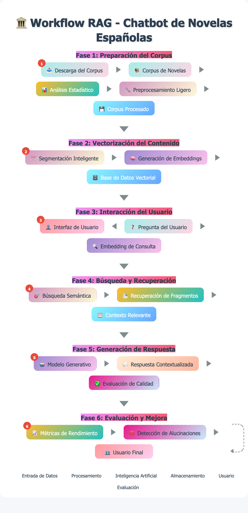

# Chatbot de Novelas Españolas

Sistema de chatbot con tecnología RAG (Retrieval-Augmented Generation) para consultas sobre un corpus de 10 novelas españolas clásicas.

## Descripción del Proyecto

Este proyecto implementa un chatbot inteligente que puede responder preguntas sobre literatura española clásica utilizando un corpus de 10 novelas. El sistema combina análisis de texto, embeddings semánticos y modelos de lenguaje para proporcionar respuestas contextualmente relevantes.

## Arquitectura del Sistema

```
10 Novelas → Preprocesamiento ligero (por novela) → Guarda corpus_procesado/novela_X/
    ↓
Script RAG → Lee corpus_procesado/novela_X/ → Chunking (por novela) → Embeddings (por novela) → ChromaDB (colecciones separadas por novela)
    ↓
Pregunta → Agente LLM (determina novela(s) relevante(s)) → Embedding de pregunta → Búsqueda en colección(es) específica(s) → Fragmentos relevantes → Modelo generativo → Respuesta
```



## Corpus de Novelas

El proyecto incluye las siguientes novelas españolas:

- **El sombrero de tres picos** - Pedro Antonio de Alarcón
- **La de Bringas** - Benito Pérez Galdós
- **La desheredada** - Benito Pérez Galdós
- **La gaviota** - Fernán Caballero
- **Los pazos de Ulloa** - Emilia Pardo Bazán
- **Pepita Jiménez** - Juan Valera
- **Peñas arriba** - José María de Pereda
- **Platero y yo** - Juan Ramón Jiménez
- **Su único hijo** - Leopoldo Alas "Clarín"
- **Tristana** - Benito Pérez Galdós

## Estructura del Proyecto

```
chatbot_novelas/
│
├── 1-analisis-preprocesamiento.ipynb # Notebook principal de análisis y preprocesamiento
├── requirements.txt                   # Dependencias del proyecto
├── .gitignore                        # Archivos excluidos del control de versiones
│
├── corpus_procesado/                 # Textos preprocesados para RAG
│   ├── El_sombrero_de_tres_picos_pg29506_processed.txt
│   ├── La_de_Bringas_314648_processed.txt
│   ├── La_desheredada_pg25956_processed.txt
│   ├── La_gaviota_pg23600_processed.txt
│   ├── Los_pazos_de_Ulloa_18005-8_UTF8_processed.txt
│   ├── Pepita_Jimenez_pg17223_processed.txt
│   ├── Peñas_arriba_pg24127_processed.txt
│   ├── Platero_y_yo_pg9980_processed.txt
│   ├── Su_unico_hijo_pg17341_processed.txt
│   └── Tristana_pg66979_processed.txt
│
├── estadisticas/                     # Archivos de estadísticas del corpus
│   └── estadisticas_corpus.csv
│
└── graficos/                        # Visualizaciones generadas
    ├── estadisticas_corpus.png
    ├── frecuencias_globales.png
    ├── similitud_lexica.png
    └── wordcloud_corpus.png
```

## Instalación y Configuración

### Requisitos Previos

- Python 3.10 o superior
- pip (gestor de paquetes de Python)

### Configuración del Entorno

#### Opción 1: Usando venv (Recomendado)

```bash
# Crear entorno virtual
python -m venv venv

# Activar entorno virtual
# En Linux/Mac:
source venv/bin/activate
# En Windows:
venv\Scripts\activate

# Instalar dependencias
pip install -r requirements.txt
```

#### Opción 2: Usando conda

```bash
# Crear entorno conda
conda create -n chatbot_novelas python=3.9

# Activar entorno
conda activate chatbot_novelas

# Instalar dependencias
pip install -r requirements.txt
```

### Instalación de Modelo de spaCy

```bash
# Instalar modelo de spaCy para español
python -m spacy download es_core_news_sm
```

### Configuración de Directorios

Antes de ejecutar el script, asegúrate de tener la estructura de directorios correcta:

```bash
# El script espera encontrar las novelas en formato .txt en:
../novelas_txt/

# Si tienes las novelas en otro directorio, modifica la variable en el script:
# corpus_directory = "ruta/a/tus/novelas"
```

## Uso del Sistema

### 1. Preprocesamiento y Análisis

### 1. Análisis y preprocesamiento.

```bash
jupyter notebook 1-analisis-preprocesamiento.ipynb
```
Esta notebook realiza:
- Carga del corpus de novelas
- Análisis estadístico completo
- Análisis de frecuencia de términos
- Generación de visualizaciones
- Preprocesamiento ligero para RAG
- Guardado de archivos procesados

### 2. Salidas Generadas

El notebook genera:
- **Archivos procesados**: `corpus_procesado/`
- **Estadísticas**: `estadisticas/estadisticas_corpus.csv`
- **Visualizaciones**: `graficos/`
  - Estadísticas del corpus
  - Frecuencias globales
  - Similitud léxica entre novelas
  - Nube de palabras

## Dependencias Principales

```
pandas==2.3.1          # Manipulación de datos
numpy==2.2.6           # Cálculos numéricos
matplotlib==3.10.3     # Visualizaciones
seaborn==0.13.2        # Visualizaciones estadísticas
nltk==3.9.1            # Procesamiento de lenguaje natural
spacy==3.8.7           # Procesamiento avanzado de NLP
wordcloud==1.9.4       # Generación de nubes de palabras
textstat==0.7.7        # Análisis de legibilidad
plotly==6.2.0          # Visualizaciones interactivas
chromadb==1.0.15       # Base de datos vectorial
sentence-transformers==5.0.0  # Generación de embeddings
```

## Características del Sistema

### Análisis de Texto
- Estadísticas básicas (palabras, caracteres, oraciones)
- Análisis de diversidad léxica
- Índices de legibilidad (Flesch)
- Análisis de frecuencia de términos
- Similitud léxica entre novelas

### Preprocesamiento para RAG
- Limpieza ligera que preserva estructura semántica
- Normalización de espacios y saltos de línea
- Preparación para chunking y embeddings

### Visualizaciones
- Gráficos estadísticos comparativos
- Matrices de similitud léxica
- Nubes de palabras
- Análisis de frecuencias

## Próximos Pasos

1. **Implementar sistema RAG**: Chunking, embeddings y ChromaDB
2. **Desarrollar agente LLM**: Determinación de novelas relevantes
3. **Crear interfaz de chat**: Sistema de preguntas y respuestas
4. **Optimizar búsqueda**: Mejoras en retrieval y ranking

## Solución de Problemas

### Error: Modelo de spaCy no encontrado
```bash
python -m spacy download es_core_news_sm
```

### Error: Directorio de corpus no encontrado
Verifica que el directorio `../novelas_txt/` existe y contiene archivos `.txt`, o modifica la variable `corpus_directory` en el script.

### Error: Recursos de NLTK no disponibles
Los recursos se descargan automáticamente al ejecutar el script. Si hay problemas, ejecuta:
```python
import nltk
nltk.download('all')
```

## Contribuciones

Para contribuir al proyecto:
1. Fork el repositorio
2. Crea una rama para tu feature
3. Implementa los cambios
4. Ejecuta las pruebas
5. Envía un pull request

## Licencia

Este proyecto está bajo la licencia MIT. Ver archivo `LICENSE` para detalles.